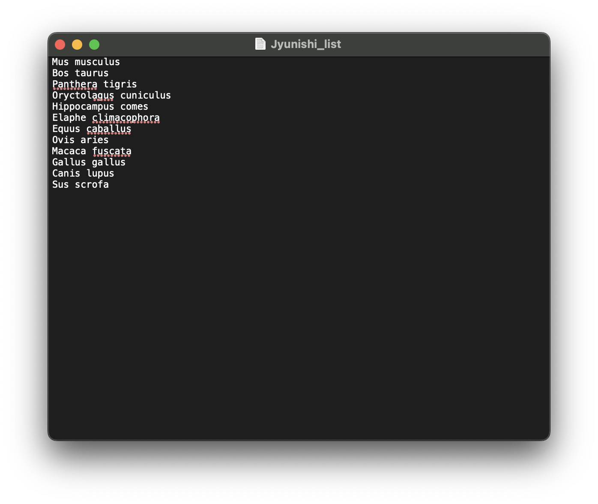
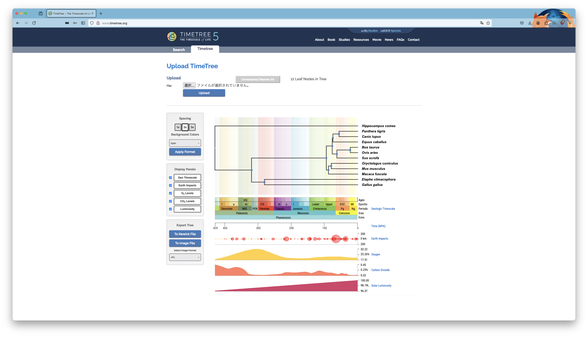
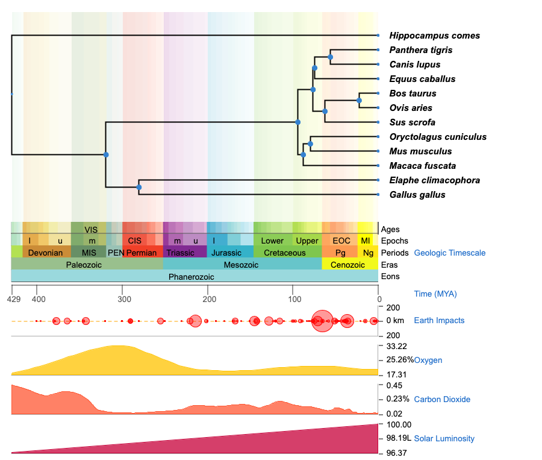
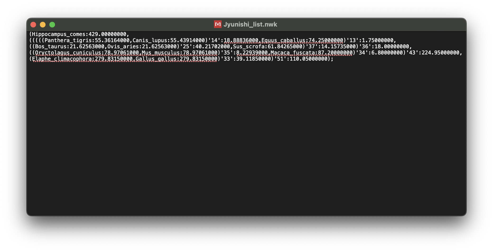

::: {.callout-note icon="false"}
## まとめ
- 系統樹の可視化やアノテーションのために作られたRパッケージ
- Newick形式（ニューウィック）などで示された系統関係をもとに系統樹を作成する
- 系統樹のデザインを色々いじれる
:::

# はじめに

Xで十二支に登場する動物の系統樹を描いた年賀状の画像を見かけた。センスのいい題材だな〜と思い、Rパッケージ[**ggtree**](https://bioconductor.org/packages/release/bioc/html/ggtree.html)を使って種の系統樹を作図してみる。

# 材料・方法

:::{.callout-note icon = "false"}
## 大まかな手順

1. TimeTree5で種の系統樹を作成する
2. TimeTree5で得られた系統関係の情報をもとにggtreeを用いてR上で系統樹を作図する
:::

ggtreeを使って系統樹を作図するためには、十二支の動物たちの系統関係を表す情報が必要になる。そこで、今回は種の分岐年代や系統関係を文献に基づいて出力してくれる[**TimeTree5**](http://www.timetree.org/)を使って、系統樹を作成する。そこで得られた系統関係の情報をもとにggtreeを用いて十二支の系統樹を作図する。

十二支の種名は以下の通り。

| Name    |    Species     |
|:-------:|:---------------|
|　子 🐭　| *Mus musculus* |
|　丑 🐮　| *Bos taurus*   |
|　寅 🐯　| *Panthera tigris* |
|　卯 🐰　| *Oryctolagus cuniculus* |
|　辰 🐲　| *Hippocampus comes* |
|　巳 🐍　| *Elaphe climacophora* |
|　午 🐴　| *Equus caballus* |
|　未 🐏　| *Ovis aries* |
|　申 🐵　| *Macaca fuscata* |
|　酉 🐔　| *Gallus gallus* |
|　戌 🐶　| *Canis lupus* |
|　亥 🐗　| *Sus scrofa* |

# 実践
## 1. TimeTree5で種の系統樹を作成する

[**TimeTree5**](http://www.timetree.org/)は、生命の進化のタイムスケールに関する情報を集めたデータベースで、膨大な数の研究がまとめられている。


今回は十二支の系統関係が知りたいので、**Build a Timetree**に十二支の動物たちの種名のリストをアップロードする。このリストは種ごとに改行した標準テキストでよい。

{width=80% fig-align="center"}

アップロード後、次のような出力結果が表示される。

{width=100% fig-align="center"}

上に系統樹、下に各種が分岐した時の地質年代や大気中の酸素や二酸化炭素の組成などが表示されている。左側のチェックボックスで図の調整やExportすることができる。

{width=100% fig-align="center"}

ggtreeにこの系統図を図のまま読み込ませることはできない。コンピュータで系統関係を表す時、**ニューウィック形式（Newick format, .newick）**という記述法が用いられる。図と同様に十二支のNewickファイルをexportすると、次のようなファイルが得られる。

{width=100% fig-align="center"}

Newick形式では、クレード同士を「,」で区切り、近縁な姉妹群を「()」でまとめる。「:」の後ろの数値はクレードごとの枝長（遺伝的距離）を示す。このようなルールで系統関係を示すことができる。しかし、Newick形式から一目で系統関係を読み解くのは難しい。そこでggtreeで系統樹を可視化する[^foot1]。

[^foot1]: ggtree以外にもapeやade4といったRパッケージもある。

## 2. ggtreeでNewick形式から系統樹を作図する

まず、ggtreeなどをインストールする。

```{r}
#| echo: true
#| warning: false # warningを非表示

# BiocManagerのインストール
if (!requireNamespace("BiocManager", quietly = TRUE)) {
  install.packages("BiocManager") 
}

# ggtreeのインストール
BiocManager::install("ggtree") # ggtreeのインストール

# ggtreeを使う時、毎回呼び出す
library("ggtree")

# apeとtidyverseも呼び出しておく
library("ape")
library("tidyverse")
```

一旦、十二支の系統樹を図示してみる。図示は``ggtree``でできる。

```{r}
#| echo: true
twelve_gods = read.tree("/Users/YukiYamashita/Desktop/R/Jyunishi_list.nwk")
ggtree(twelve_gods)
```

系統樹の樹形を変えることもでき、論文でよくみるあの形にもすることができる。全11種類もある。

:::{.panel-tabset}
## Rectangular (Default)
```{r}
ggtree(twelve_gods, layout = "rectangular")
```

## Slanted
```{r}
ggtree(twelve_gods, layout = "slanted")
```

## Circular
```{r}
ggtree(twelve_gods, layout = "circular")
```

## Fan
```{r}
ggtree(twelve_gods, layout = "fan")
# open.angleという引数を追加して変形も可能
ggtree(twelve_gods, layout = "fan", open.angle = 180)
```

## Equal_angle
```{r}
ggtree(twelve_gods, layout = "equal_angle")
```

## Daylight
```{r}
ggtree(twelve_gods, layout = "daylight")
```

## Dendrogram
```{r}
ggtree(twelve_gods, layout = "dendrogram")
```

## Roundrect
```{r}
ggtree(twelve_gods, layout = "roundrect")
```

## Inward_circular
```{r}
ggtree(twelve_gods, layout = "inward_circular")
# xlimで中心部分の余白を調整可能
ggtree(twelve_gods, layout = "inward_circular", xlim = 1000)
# xlimを大きくしすぎると、枝が消滅
ggtree(twelve_gods, layout = "inward_circular", xlim = 1000000)
# xlimを小さくしすぎると、点になる
ggtree(twelve_gods, layout = "inward_circular", xlim = 1)
```

## Radial
```{r}
ggtree(twelve_gods, layout = "radial")
```

## Ape
```{r}
ggtree(twelve_gods, layout = "ape")
```

## Cladogram
```{r}
# 引数branch.lengthを"none"にすると、クラドグラムになる（全ての樹形に対応）
# クラドグラムとは、遺伝的距離を考慮しない系統関係だけを表した系統樹
# "none"は小文字
ggtree(twelve_gods, layout = "rectangular", branch.length = "none")
ggtree(twelve_gods, layout = "circular", branch.length = "none")
```

:::

系統樹を作図することはできたが、これではどこにどの動物がいるのか分からない。とりあえず、``geom_tiplab()``と``geom_text2()``で動物の種名とノードの番号を配置してみる。

```{r}
# geom_tiplab()で枝末端にラベルをつける
# 種名が見切れてしまうので、xlim_tree()でx軸の範囲を指定
# geom_text2()でノードの番号をつける
# colourで色を変えたり、nudge_xでx軸方向へ移動させたり整える

ggtree(twelve_gods) + 
  geom_tiplab(nudge_x = 40) +
  geom_text2(aes(label = node), colour = "darkgray", nudge_x = 20) +
  xlim_tree(800)
```

これで十二支の動物たちの種の系統樹を作図することができた。<br>
ggtreeでは他にも系統樹全体のデザインを変えたりすることができる。枝の色や太さが変えられるだけではなく、線の種類を変えることもできる。

ggtreeには``geom_tree()``などのggplot2をベースにした関数が多くある。最初、``ggtree(twelve_gods) + geom_tree(linetype = 2)``で線の種類を変えようとしたが、実線と破線が重なったような見た目になった。調べたところ、``geom_tree()``はggplot2の``geom_XXX()``のような関数と同じ位置付けのようで、``ggtree()``=``ggplot(twelve_gods) + geom_tree() + theme_tree()``という感じらしい。

:::{.panel-tabset}
## Solid (Default) (1)

```{r}
# colorで線の色、linewidthで線の太さ、linetypeで線の種類を変える
# 黒色、太さ0.5、実線がデフォルト

ggtree(twelve_gods, color = "red", linewidth = 2) + 
  geom_tiplab(nudge_x = 40) +
  geom_text2(aes(label = node), colour = "darkgray", nudge_x = 20) +
  xlim_tree(800)
```

## Dashed (2)
```{r}
# linetypeは数字でも選択可能
# 破線

ggtree(twelve_gods, linetype = 2) + 
  geom_tiplab(nudge_x = 40) +
  geom_text2(aes(label = node), colour = "darkgray", nudge_x = 20) +
  xlim_tree(800)
```

## Dotted (3)
```{r}
# 点線

ggtree(twelve_gods, linetype = 3) + 
  geom_tiplab(nudge_x = 40) +
  geom_text2(aes(label = node), colour = "darkgray", nudge_x = 20) +
  xlim_tree(800)
```

## Dotdash (4)
```{r}
# 点線と破線の混合

ggtree(twelve_gods, linetype = 4) + 
  geom_tiplab(nudge_x = 40) +
  geom_text2(aes(label = node), colour = "darkgray", nudge_x = 20) +
  xlim_tree(800)
```

## Longdash (5)
```{r}
# 長い破線

ggtree(twelve_gods, linetype = 5) + 
  geom_tiplab(nudge_x = 40) +
  geom_text2(aes(label = node), colour = "darkgray", nudge_x = 20) +
  xlim_tree(800)
```

## Twodash (6)
```{r}
# 2つの短い破線の繰り返し

ggtree(twelve_gods, linetype = 6) + 
  geom_tiplab(nudge_x = 40) +
  geom_text2(aes(label = node), colour = "darkgray", nudge_x = 20) +
  xlim_tree(800)
```

## Blank (0)
```{r}
# 線を消すこともできる

ggtree(twelve_gods, linetype = 0) + 
  geom_tiplab(nudge_x = 40) +
  geom_text2(aes(label = node), colour = "darkgray", nudge_x = 20) +
  xlim_tree(800)
```

:::

:::{.callout-caution}
## ggtree()とgeom_tree()

ggtreeには``geom_tree()``などのggplot2をベースにした関数が多くある。最初、``ggtree(twelve_gods) + geom_tree(linetype = 2)``で線の種類を変えようとしたが、実線と破線が重なったような見た目になった。
```{r}
ggtree(twelve_gods) + 
  geom_tree(color = "red", linetype = 2) +
  geom_tiplab(nudge_x = 40) +
  geom_text2(aes(label = node), colour = "darkgray", nudge_x = 20) +
  xlim_tree(800)
```
調べたところ、やはり両方の系統樹が存在している状態のよう。``geom_tree()``はggplot2の``geom_XXX()``のような関数と同じ位置付けのようで、``ggtree()``=``ggplot(twelve_gods) + geom_tree() + theme_tree()``という感じ。つまり、どちらか片方を用いてベースとなる系統樹を作図するのが良いということになる。実際に``ggplot()``を使って上で示した系統樹を作成してみると、
```{r}
ggplot(twelve_gods) +
  geom_tree(color = "red", linetype = 3) +
  theme_tree() +
  geom_tiplab(nudge_x = 40) +
  xlim_tree(800)
```
こんな感じになる。ただ、``ggtree()``では、Newick形式からノードとリーフ（枝末端）をうまく取り扱ってくれているのに対し、``geom_tree()``を使う場合、Newick形式の系統樹の座標データをデータフレームに変換した後、データフレームから系統樹を作るイメージで作業する必要がある。面倒くさいので、``ggtree()``を使う方が吉？
:::
